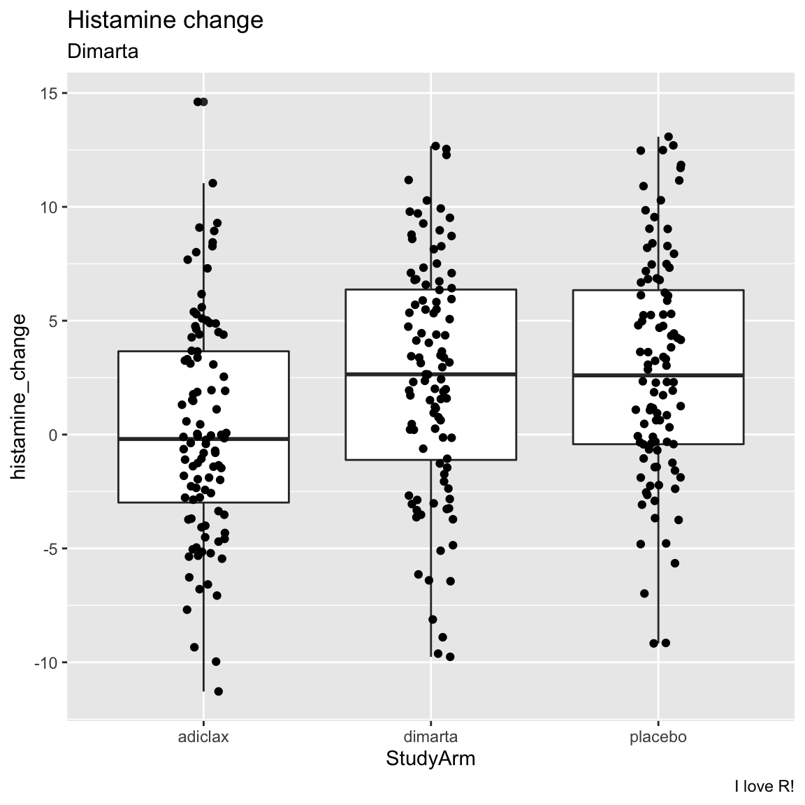
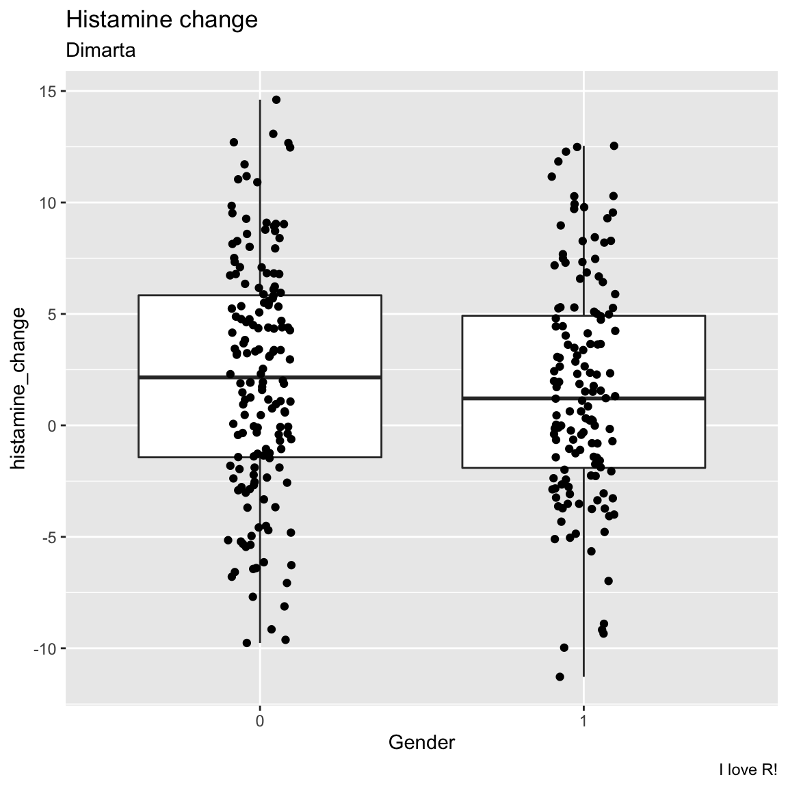
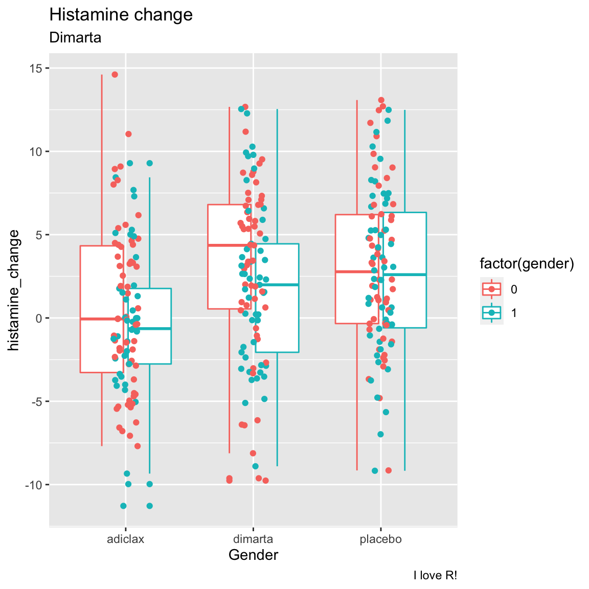
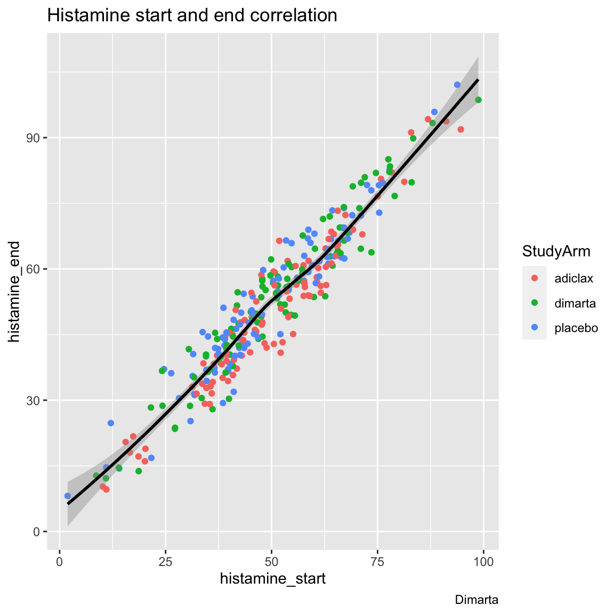
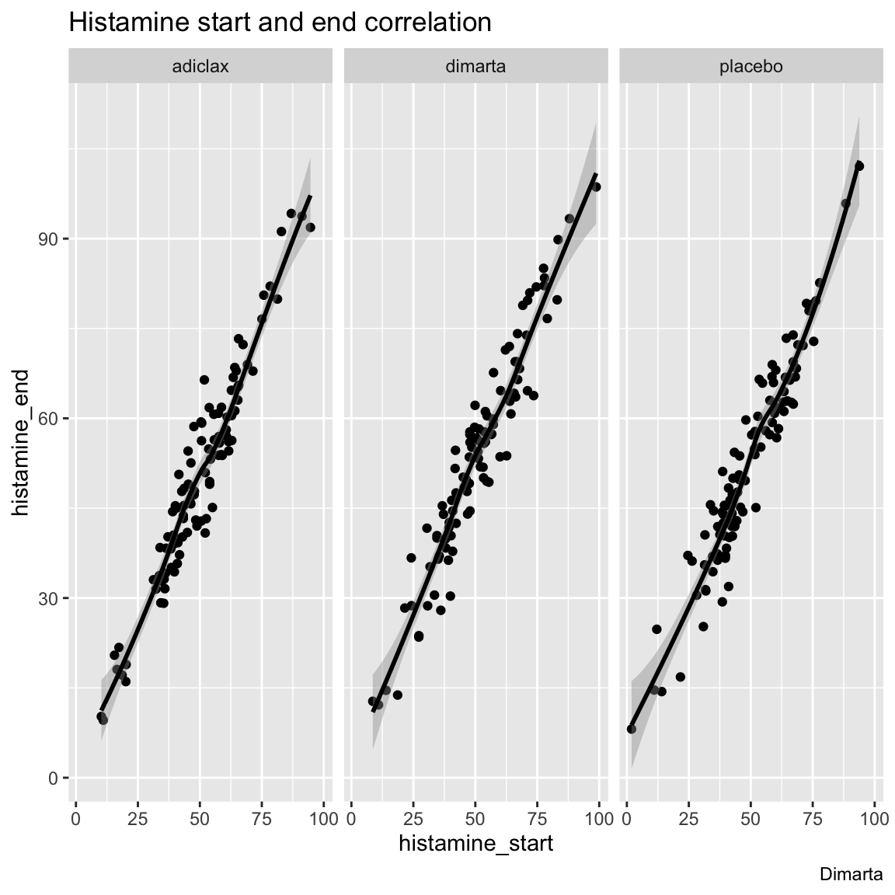

<figure>
<center>
  
  <figcaption><a href="http://www.formerfda.com/wp-content/uploads/2014/08/clinical-trials.jpg">source</a></figcaption>
</figure>


# {.tabset}


## Overview

In this case study, we will look at the results of a clinical trial exploring the effectiveness of a new medication called dimarta on reducing histamine in patients with a disease that leads to chronically high histamine levels. In the study, 300 patients were assigned to one of three different treatment arms. One arm was given a placebo. The other arm was given adiclax -- the standard of care for the disease. Finally, the third arm was given dimarta. There were two main measures of interest in the trial: patient's changes in histamine from the beginning to the end of the trial, and their change in quality of life (measured by self report). 

In addition to exploring the effects of the three medications, the researchers are interested in the extent to which three different biomarkers, dw, ms, and np, are correlated with therapeutic outcomes. In other words, to patients that express one or more of these biomarkers have better, or worse, outcomes that those that do not express these biomarkers?

## Datasets


```r
library(tidyverse)
library(haven)
```

|File | Rows | Columns | Description |
|:----|:-----|:------|:-----------------------------------------|
|[dimarta_trial.csv](https://raw.githubusercontent.com/therbootcamp/BaselRBootcamp_2018July/master/_sessions/_data/baselrbootcamp_data/dimarta_trial.csv) | 300 | 6 | Key DIMARTA trial outcomes|
|[dimarta_biomarker.csv](https://raw.githubusercontent.com/therbootcamp/BaselRBootcamp_2018July/master/_sessions/_data/baselrbootcamp_data/dimarta_biomarker.csv) | 900 | 3 | Biomarker status' for 3 different biomarkers for each patient. |
|[dimarta_demographics.csv](https://raw.githubusercontent.com/therbootcamp/BaselRBootcamp_2018July/master/_sessions/_data/baselrbootcamp_data/dimarta_demographics.csv) | 300 | 5 | Demographic information for each patient |

Column Descriptions

**dimarta_trial.csv**

| Variable| Description|
|:------------------------------|:----------------------------------------------------------------|
|     PatientID|    Unique patient id|
|     arm|  Treatment arm, either 1 = placebo, 2 = adiclax (the standard of treatment), or 3 = dimarta (the target drug)| 
|     histamine_start| histamine value at the start of the trial|
|     histamine_end| histamine value at the end of the trial|
|     qol_start| Patient's rated quality of life at the start of the trial|
|     qol_end| Patient's rated quality of life at the end of the trial|

Table: Table1. `dimarta_trial.csv` variable description:

**dimarta_demographics.csv**

| Variable| Description|
|:------------------------------|:----------------------------------------------------------------|
|     PatientID|    Unique patient id|
|     age|   Patient age| 
|     gender| Patient gender, 0 = male, 1 = female|
|     site| Site where the clinical trial was conducted|
|     diseasestatus| Status of the patient's disease at start of trial|

Table: Table2. `dimarta_demographics.csv` variable description:

**dimarta_biomarker.csv**

| Variable| Description|
|:------------------------------|:----------------------------------------------------------------|
|     PatientID|    Unique patient id|
|     Biomarker|    One of three biomarkers: dw, ms, and np| 
|     BiomarkerStatus| Result of the test for the biomarker.|

Table: Table3. `dimarta_biomarker.csv` variable description:


## Tasks

### A - Getting Setup

1. Open your `baselrbootcamp` R project. It should already have the folders `1_Data` and `2_Code`.

2. Open a new R script and save it as a new file in your `R` folder called `dimarta_casestudy.R`. At the top of the script, using comments, write your name and the date. Then, load the `tidyverse` package. Here's how the top of your script should look:


```r
## My Name
## The Date
## Dimarta - Case Study

library(tidyverse)
```

### B - Data I/O

2. Using `read_csv()`, load the `dimarta_trial.csv`, `dimarta_demographics.csv`, and `dimarta_biomarker.csv` datasets as *three* new objects called `trial_df`, `demographics_df`, and `biomarker_df`.


3. Get a first impression of the objects you just created by exploring them with a mixture of the `View()`, `head()`, `names()`, and `str()` functions. Were they all loaded correctly?


```r
trial_df
```

```
# A tibble: 300 x 6
   PatientID   arm histamine_start histamine_end qol_start qol_end
   <chr>     <dbl>           <dbl>         <dbl>     <dbl>   <dbl>
 1 txdjezeo      1            58.6          67.0         3       3
 2 htxfjlxk      3            36.1          28.0         3       4
 3 vkdqhyez      1            57.7          57.3         2       2
 4 dbuvrwfq      3            56.6          57.4         2       3
 5 ydaitaah      2            64.7          67.9         5       7
 6 omhxokdr      1            37.4          41.7         2       2
 7 dsybafny      1            88.4          95.9         4       6
 8 fdfmcoto      2            20.2          18.9         2       2
 9 rwsbykxe      2            48.3          43.0         3       3
10 xocueqqe      3            48.6          55.2         1       1
# … with 290 more rows
```

```r
demographics_df
```

```
# A tibble: 300 x 5
   PatientID   age gender site   diseasestatus
   <chr>     <dbl>  <dbl> <chr>  <chr>        
 1 pkyivajv     36      0 Tokyo  Mid          
 2 dbuvrwfq     39      0 Paris  Late         
 3 jhuztppp     30      0 Tokyo  Mid          
 4 qejexgza     34      1 Tokyo  Late         
 5 cszrjxju     41      1 Tokyo  Late         
 6 uhvgttqh     31      0 London Late         
 7 cflnybdw     45      1 Tokyo  Mid          
 8 igobmmvj     48      0 Tokyo  Late         
 9 lcrtmerg     35      0 London Late         
10 fjjrnsnt     43      1 London Mid          
# … with 290 more rows
```

```r
biomarker_df
```

```
# A tibble: 900 x 3
   PatientID Biomarker BiomarkerStatus
   <chr>     <chr>     <lgl>          
 1 ygazqssv  dw        FALSE          
 2 qosueuyw  ms        FALSE          
 3 bhhykjvw  ms        FALSE          
 4 ifajorty  np        TRUE           
 5 gxnsybdt  ms        FALSE          
 6 igobmmvj  ms        FALSE          
 7 knnzlzun  ms        FALSE          
 8 glzcbmby  ms        FALSE          
 9 gxnsybdt  dw        TRUE           
10 fzrhdpdu  np        FALSE          
# … with 890 more rows
```

### C - Data Wrangling

1. Change the name of the column `arm` in the `trial_df` data to `StudyArm`.


```r
trial_df <- trial_df %>%
  rename(StudyArm = arm)
```

2. Using the `table()` function, look at the values of the `StudyArm` column in `trial_df`. You'll notice the values are 1, 2, and 3. Using `mutate()` and `case_when()` change these values to the appropriate names of the study arms (look at the variable descriptions to see which is which!)


```r
# table(trial_df$StudyArm)

trial_df <- trial_df %>%
  mutate(StudyArm = case_when(
    StudyArm == 1 ~ "placebo",
    StudyArm == 2 ~ "adiclax",
    StudyArm == 3 ~ "dimarta"
  ))
```


3. In the `demographics_df` data, you'll see that gender is coded as 0 and 1. Using `mutate()` create a *new* column in `demographics_df` called `gender_c` that shows gender as a string, where 0 = "male", and 1 = "female".


```r
demographics_df <- demographics_df %>%
  mutate(gender_c = case_when(
    gender == 0 ~ "male",
    gender == 1 ~ "female"
  ))
```

4. Now let's create a new object called `dimarta_df` that combines data from `trial_df` and `demographics_df`. To do this, use `left_join()` to combine the `trial_df` data with the `demographics_df` data. This will merge the two datasets so you can have the study results and demographic data in the same dataframe. Make sure to assign the result to a new object called `dimarta_df`


```r
# Create a new dataframe called dimarta_df that contains both trial_df and demographics_df
dimarta_df <- trial_df %>%
  left_join(demographics_df)
```

```
Joining, by = "PatientID"
```

5. You'll notice that the `biomarker_df` dataframe is in the 'long' format, where each row is a patient's biomarker result. Making use of the `spread()` function, create a new dataframe called `biomarker_wide_df` where each row is a patient, and the results from different biomarkers are in different columns. When you finish, look at `biomarker_wide_df` to see how it looks!


```r
# Convert biomarker_df to a wide format using spread()
biomarker_wide_df <- biomarker_df %>%
  spread(Biomarker, BiomarkerStatus)
```

6. Now, using the `left_join` function, add the `biomarker_wide_df` data  to the `dimarta_df` data! Now you should have all of the data in a single dataframe called `dimarta_df`


```r
dimarta_df <- dimarta_df %>% 
  left_join(biomarker_wide_df)
```

```
Joining, by = "PatientID"
```

7. View `dimarta_df` to make sure the data look correct! The data should have one row for each patient, and 13 separate columns, including  `dw`, `ms`, and `np` 


```r
dimarta_df
```

```
# A tibble: 300 x 14
   PatientID StudyArm histamine_start histamine_end qol_start qol_end   age
   <chr>     <chr>              <dbl>         <dbl>     <dbl>   <dbl> <dbl>
 1 txdjezeo  placebo             58.6          67.0         3       3    39
 2 htxfjlxk  dimarta             36.1          28.0         3       4    42
 3 vkdqhyez  placebo             57.7          57.3         2       2    47
 4 dbuvrwfq  dimarta             56.6          57.4         2       3    39
 5 ydaitaah  adiclax             64.7          67.9         5       7    35
 6 omhxokdr  placebo             37.4          41.7         2       2    41
 7 dsybafny  placebo             88.4          95.9         4       6    35
 8 fdfmcoto  adiclax             20.2          18.9         2       2    50
 9 rwsbykxe  adiclax             48.3          43.0         3       3    35
10 xocueqqe  dimarta             48.6          55.2         1       1    42
# … with 290 more rows, and 7 more variables: gender <dbl>, site <chr>,
#   diseasestatus <chr>, gender_c <chr>, dw <lgl>, ms <lgl>, np <lgl>
```

8. Using the `mean()` function, calculate the mean age of all patients.


```r
mean(dimarta_df$age)
```

```
[1] 39.9
```

9. Create a table showing how many male and female patients were in the trial.


```r
dimarta_df %>%
  group_by(gender_c) %>%
  summarise(
    Counts = n()    
  )
```

```
# A tibble: 2 x 2
  gender_c Counts
  <chr>     <int>
1 female      140
2 male        160
```

10. Now, using similar code, find out how many patients were assigned to each study arm.


```r
dimarta_df %>%
  group_by(StudyArm) %>%
  summarise(
    Counts = n()    
  )
```

```
# A tibble: 3 x 2
  StudyArm Counts
  <chr>     <int>
1 adiclax     100
2 dimarta     100
3 placebo     100
```

11. Find out how many men and women were assigned to each study arm (Hint: You can use very similar code to what you used above, just add a second grouping variable!)


```r
dimarta_df %>%
  group_by(StudyArm, gender_c) %>%
    mutate(Counts = n())
```

```
# A tibble: 300 x 15
# Groups:   StudyArm, gender_c [6]
   PatientID StudyArm histamine_start histamine_end qol_start qol_end   age
   <chr>     <chr>              <dbl>         <dbl>     <dbl>   <dbl> <dbl>
 1 txdjezeo  placebo             58.6          67.0         3       3    39
 2 htxfjlxk  dimarta             36.1          28.0         3       4    42
 3 vkdqhyez  placebo             57.7          57.3         2       2    47
 4 dbuvrwfq  dimarta             56.6          57.4         2       3    39
 5 ydaitaah  adiclax             64.7          67.9         5       7    35
 6 omhxokdr  placebo             37.4          41.7         2       2    41
 7 dsybafny  placebo             88.4          95.9         4       6    35
 8 fdfmcoto  adiclax             20.2          18.9         2       2    50
 9 rwsbykxe  adiclax             48.3          43.0         3       3    35
10 xocueqqe  dimarta             48.6          55.2         1       1    42
# … with 290 more rows, and 8 more variables: gender <dbl>, site <chr>,
#   diseasestatus <chr>, gender_c <chr>, dw <lgl>, ms <lgl>, np <lgl>,
#   Counts <int>
```

12. Add a new column to the `dimarta_df` data called `histamine_change` that shows the *change* in patient's histamine levels from the start to the end of the trial (Hint: use `mutate()` and just subtract `histamine_start` from `histamine_end`!)


```r
dimarta_df <- dimarta_df %>%
  mutate(
    histamine_change = histamine_end - histamine_start
  )
```

13. Add a new column to `dimarta_df` called `qol_change` that shows the change in patient's quality of life.


```r
dimarta_df <- dimarta_df %>%
  mutate(
    qol_change = qol_end - qol_start
  )

# Look at result
dimarta_df %>% 
  select(qol_change)
```

```
# A tibble: 300 x 1
   qol_change
        <dbl>
 1          0
 2          1
 3          0
 4          1
 5          2
 6          0
 7          2
 8          0
 9          0
10          0
# … with 290 more rows
```

14. Calculate the percentage of patients who tested positive for each of the three biomarkers (Hint: If you calculate the `mean()` of a logical vector, you will get the percentage of TRUE values!)


```r
# Calculate percent of patients with positive biomarkers

dimarta_df %>%
  summarise(
    dw_mean = mean(dw),
    ms_percent = mean(ms),
    np_percent = mean(np)
  )
```

```
# A tibble: 1 x 3
  dw_mean ms_percent np_percent
    <dbl>      <dbl>      <dbl>
1   0.257       0.19      0.233
```

15. Were there different distributions of age in the different trial sites? To answer this, separately calculate the mean and standard deviations of patient ages in each site. (Hint: group the data by `site`, then calculate two separate summary statistics: `age_mean = mean(age)`, and `age_sd = sd(age)`.


```r
# Calculate the mean change in histamine for each study site
dimarta_df %>%
  group_by(site) %>%
  summarise(
    age_mean = mean(age),
    age_sd = sd(age)
  )
```

```
# A tibble: 3 x 3
  site   age_mean age_sd
  <chr>     <dbl>  <dbl>
1 London     39.9   5.86
2 Paris      39.8   4.84
3 Tokyo      40.1   4.50
```

16. Calculate the mean change in histamine results separately for each study site 


```r
# Calculate the mean change in histamine for each study site
dimarta_df %>%
  group_by(site) %>%
  summarise(
    histamine_change_mean = mean(histamine_change, na.rm = TRUE)
  )
```

```
# A tibble: 3 x 2
  site   histamine_change_mean
  <chr>                  <dbl>
1 London                  1.99
2 Paris                   2.29
3 Tokyo                   1.29
```


17. Calculate the mean change in histamine results (`histamine_change`) for each study arm. Which study arm had a largest decrease in histamine?


```r
# Calculate the mean change in histamine for each study site
dimarta_df %>%
  group_by(StudyArm) %>%
  summarise(
    histamine_change_mean = mean(histamine_change, na.rm = TRUE)
  )
```

```
# A tibble: 3 x 2
  StudyArm histamine_change_mean
  <chr>                    <dbl>
1 adiclax                  0.210
2 dimarta                  2.51 
3 placebo                  2.90 
```

18. Calculate the mean change in quality of life (`qol_change`) for each study arm. Do the results match what you found with the histamine results?


```r
# Calculate the mean change in histamine for each study site
dimarta_df %>%
  group_by(StudyArm) %>%
  summarise(
    qol_change_mean = mean(qol_change, na.rm = TRUE)
  )
```

```
# A tibble: 3 x 2
  StudyArm qol_change_mean
  <chr>              <dbl>
1 adiclax             0.06
2 dimarta             0.01
3 placebo            -0.15
```

### D - Plotting

1. Create boxplots showing the relationship between study arm and histamine change.


```r
ggplot(data = dimarta_df,
       mapping = aes(x = StudyArm, 
                     y = histamine_change)) +
  geom_boxplot() +
  labs(title = "Histamine change",
       subtitle = "Dimarta",
       caption = "I love R!")
```



2. Try using `geom_jitter()` to add the raw points to the plot


```r
ggplot(data = dimarta_df,
       mapping = aes(x = StudyArm, 
                     y = histamine_change)) +
  geom_boxplot() + 
  geom_jitter(width = .1) +
  labs(title = "Histamine change",
       subtitle = "Dimarta",
       caption = "I love R!")
```



3. Create the same plot as above, but instead of analysing study arm, try analysing gender. (Tip! convert gender to a factor with `factor(gender)`) What do you find? Did one gender have better histamine improvements than the other?


```r
ggplot(data = dimarta_df,
       mapping = aes(x = factor(gender), 
                     y = histamine_change)) +
  geom_boxplot() +
  geom_jitter(width = .1) +
  labs(title = "Histamine change",
       subtitle = "Dimarta",
       caption = "I love R!",
       x = "Gender")
```




4. Now create the same plot but show both gender and study arm in the same plot. One way to do this would be to color the points by gender!


```r
ggplot(data = dimarta_df,
       mapping = aes(x = StudyArm, 
                     y = histamine_change,
                     col = factor(gender))) +
  geom_boxplot() +
  geom_jitter(width = .1) +
  labs(title = "Histamine change",
       subtitle = "Dimarta",
       caption = "I love R!",
       x = "Gender")
```


5. Is there a correlation between patient's starting and ending histamiine levels? Create a scatterplot with a regression line to find out!


```r
ggplot(data = dimarta_df,
       aes(x = histamine_start, 
           y = histamine_end)) +
  geom_point() + 
  geom_smooth() +
  labs(title = "Histamine start and end correlation",
       caption = "Dimarta")
```



6. Now create the same plot as above, but have different colored points for different study arms (but only one regression line).


```r
ggplot(data = dimarta_df,
       aes(x = histamine_start, 
           y = histamine_end,
           col = StudyArm)) +
  geom_point() + 
  geom_smooth(col = "black") +
  labs(title = "Histamine start and end correlation",
       caption = "Dimarta")
```



7. Instead of having different study arms as different colored points, create another plot using `facet_wrap()` to have different study arms in different plotting panels.


```r
ggplot(data = dimarta_df,
       aes(x = histamine_start, 
           y = histamine_end)) +
  geom_point() + 
  geom_smooth(col = "black") +
  facet_wrap(~ StudyArm) +
  labs(title = "Histamine start and end correlation",
       caption = "Dimarta")
```


### E - Statistics

1. Create a regression model predicting final histamine levels as a function of all variables in the dataset that make clinical sense to include. Call it `full_glm`.


```r
full_glm <- glm(formula = histamine_end ~ age + StudyArm + gender + site + histamine_start,
                data = dimarta_df)
```


2. Explore the object with `summary()`, `tidy()` (part of the `broom` package), and `names()`. Which variables predict final histamine levels? 

```r
summary(full_glm)
```

```

Call:
glm(formula = histamine_end ~ age + StudyArm + gender + site + 
    histamine_start, data = dimarta_df)

Deviance Residuals: 
    Min       1Q   Median       3Q      Max  
-12.520   -3.377    0.039    3.549   14.252  

Coefficients:
                Estimate Std. Error t value Pr(>|t|)    
(Intercept)      -2.8252     2.5661   -1.10  0.27182    
age               0.0909     0.0569    1.60  0.11104    
StudyArmdimarta   2.3565     0.7051    3.34  0.00094 ***
StudyArmplacebo   2.6696     0.7063    3.78  0.00019 ***
gender           -0.7843     0.5776   -1.36  0.17554    
siteParis         0.2599     0.6968    0.37  0.70938    
siteTokyo        -0.7062     0.7124   -0.99  0.32237    
histamine_start   0.9979     0.0172   58.06  < 2e-16 ***
---
Signif. codes:  0 '***' 0.001 '**' 0.01 '*' 0.05 '.' 0.1 ' ' 1

(Dispersion parameter for gaussian family taken to be 24.7)

    Null deviance: 91708.9  on 299  degrees of freedom
Residual deviance:  7213.3  on 292  degrees of freedom
AIC: 1823

Number of Fisher Scoring iterations: 2
```

```r
library(broom)

tidy(full_glm)
```

```
# A tibble: 8 x 5
  term            estimate std.error statistic   p.value
  <chr>              <dbl>     <dbl>     <dbl>     <dbl>
1 (Intercept)      -2.83      2.57      -1.10  2.72e-  1
2 age               0.0909    0.0569     1.60  1.11e-  1
3 StudyArmdimarta   2.36      0.705      3.34  9.40e-  4
4 StudyArmplacebo   2.67      0.706      3.78  1.90e-  4
5 gender           -0.784     0.578     -1.36  1.76e-  1
6 siteParis         0.260     0.697      0.373 7.09e-  1
7 siteTokyo        -0.706     0.712     -0.991 3.22e-  1
8 histamine_start   0.998     0.0172    58.1   2.09e-162
```

```r
names(full_glm)
```

```
 [1] "coefficients"      "residuals"         "fitted.values"    
 [4] "effects"           "R"                 "rank"             
 [7] "qr"                "family"            "linear.predictors"
[10] "deviance"          "aic"               "null.deviance"    
[13] "iter"              "weights"           "prior.weights"    
[16] "df.residual"       "df.null"           "y"                
[19] "converged"         "boundary"          "model"            
[22] "call"              "formula"           "terms"            
[25] "data"              "offset"            "control"          
[28] "method"            "contrasts"         "xlevels"          
```

3. Add the residuals from this model as a new column in your data called `residuals_full`


```r
dimarta_df <- dimarta_df %>%
  mutate(residuals_full = full_glm$residuals)
```

4. Plot the residuals from the regression as a histogram (hint: you can find the residuals in your regression object). How do they look?


```r
ggplot(dimarta_df,
       aes(x = residuals_full)) +
  geom_histogram()
```

```
`stat_bin()` using `bins = 30`. Pick better value with `binwidth`.
```


5. Add the absolute value of the residuals from the model as a new column in your data called `residuals_abs_full` 


```r
dimarta_df <- dimarta_df %>%
  mutate(residuals_abs_full = abs(residuals_full))
```

6. Plot the absolute value of the residuals as a histogram. How do these look?


```r
ggplot(dimarta_df,
       aes(x = residuals_abs_full)) +
  geom_histogram()
```

```
`stat_bin()` using `bins = 30`. Pick better value with `binwidth`.
```


7. What is the mean value of the absolute value of this residuals?


```r
dimarta_df %>%
  summarise(residuals_abs_full_mean = mean(residuals_abs_full))
```

```
# A tibble: 1 x 1
  residuals_abs_full_mean
                    <dbl>
1                    3.95
```

8. Now create a regression model predicting histamine change based *only* on the study arm. Call it `arm_glm`. Then follow the steps above to add the residuals (original and absolute) from this model to your dataframe. Call them `residuals_arm` and `residuals_abs_arm`.


```r
arm_glm <- glm(formula = histamine_end ~ StudyArm,
               data = dimarta_df)
```

9. Calculate the mean of the raw and absolute residuals from your `arm_glm` model. How do they compare to your `full_glm` model? What does this mean?


```r
mean(arm_glm$residuals)
```

```
[1] 1.67e-14
```

```r
mean(abs(arm_glm$residuals))
```

```
[1] 13.8
```


