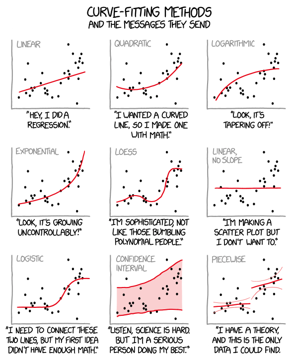

layout: true

<div class="my-footer">
  <span style="text-align:center">
    <span> 
      
    </span>
    <a href="https://therbootcamp.github.io/">
      <span style="padding-left:82px"> 
        <font color="#7E7E7E">
          www.therbootcamp.com
        </font>
      </span>
    </a>
    <a href="https://therbootcamp.github.io/">
      <font color="#7E7E7E">
       Introduction to R | February 2019
      </font>
    </a>
    </span>
  </div> 

---

```{r setup, include=FALSE}
options(htmltools.dir.version = FALSE)
# see: https://github.com/yihui/xaringan
# install.packages("xaringan")
# see: 
# https://github.com/yihui/xaringan/wiki
# https://github.com/gnab/remark/wiki/Markdown

  
options(max.print = 20)
options(width=110)
options(digits = 4)
library(tidyverse)
ChickWeight <- as.data.frame(ChickWeight)
baselers <- read_csv("https://raw.githubusercontent.com/therbootcamp/baselers/master/inst/extdata/baselers.txt")

trial_X <- data.frame(id = 1:5,
           sex = c("m", "f", "f", "m", "f"),
           age = c(35, 42, 24, 56, 49),
           arm = c(1, 2, 1, 2, 1),
           y_primary = c(50, 78, 46, 97, 74),
           y_secondary = c(1, 1, 0, 1, 1)
           )

knitr::opts_chunk$set(warning = FALSE)

```

.pull-left45[

# Linear models


#### <high>Run linear models</high> with `stats` including...

| Function| Purpose |
|:-----|:-------| 
| `lm()`, `glm()`| (Generalized) linear models  |
| `lmer()`, `glmer()` | (Generalized) mixed-linear models |
| `stan_glm()` | Bayesian (generalized) linear models |


#### <high>Explore linear models</high> with `stats`

| Function| Purpose |
|:-----|:-------| 
| `summry()`, `print()`| (Generalized) linear models  |
| `anova()` | (Generalized) mixed-linear models |
| `stan_glm()` | Bayesian (generalized) linear models |

]

.pull-right45[

<p align = "center">
<br>
<br>
<font style="font-size:10px">adapted from <a href="https://xkcd.com/892/">xkcd.com</a></font>
</p>
]


---


---

# Basic structure of statistical functions

.pull-left4[

Statistical functions always require a <high>data frame</high> called `data`, e.g.,...

```{r, echo = FALSE}
baselers %>%
  slice(1:3) %>% select(2:6) %>% knitr::kable(format = 'markdown')
```
<br>
They also require a <high>formula</high> that specifies a <high>dependent</high> variable (y) as a function of one or more <high>independent</high> variables (x1, x2, ...) in the form:

<p align='center'><font size = 6>formula = y ~ x1 + x2 +...</font></p>

]

.pull-right55[

How to create a statistical object:

```{r}
# Example: Create regression object (my_glm)
my_glm <- glm(formula = income ~ age + height,
              data = baselers)
```


```{r, echo = FALSE}
knitr::include_graphics("https://raw.githubusercontent.com/therbootcamp/Erfurt_2018June/master/_sessions/_image/formula_description.png")
```


]

---
 
.pull-left35[

 # Look for optional arguments

Statistical functions usually have many optional arguments.

Each of these have <high>default</high> values. To customise a test, <high>look at the help menu</high> and specify arguments explicitly.

]


.pull-right6[

<br><br>

<u>Default vs. customised `glm()` (Generalized linear model)</u>
```{r, eval = FALSE}
# Default
glm(formula = income ~ age + education,
    data = baselers)

# Customised
glm(formula = eyecor ~ age + education,
    data = baselers,
    family = "binomial")  # Logistic regression
```

<u>Default vs. customised `t-test`</u>

```{r, eval = FALSE}
# Default
t.test(formula = age ~ sex,
       data = baselers)

# Customised
t.test(formula = age ~ sex,
       data = baselers,
       alternative = "less", # One sided test
       var.equal = TRUE)     # Assume equal variance
```

]


---
 
.pull-left35[

 # Look for optional arguments

```{r}
?glm
```

<p align="center">
  
</p>

]


.pull-right6[

<br><br>

<u>Default vs. customised `glm()` (Generalized linear model)</u>
```{r, eval = FALSE}
# Default
glm(formula = income ~ age + education,
    data = baselers)

# Customised
glm(formula = eyecor ~ age + education,
    data = baselers,
    family = "binomial")  # Logistic regression
```

<u>Default vs. customised `t-test`</u>

```{r, eval = FALSE}
# Default
t.test(formula = age ~ sex,
       data = baselers)

# Customised
t.test(formula = age ~ sex,
       data = baselers,
       alternative = "less", # One sided test
       var.equal = TRUE)     # Assume equal variance
```

]


---


# Regression with `glm()`, `lm()`

.pull-left35[

How to <high>create a regression model</high> predicting, e.g., how much money people spend on `food` as a function of `income`?

<br>
Part of the `baselers` dataframe:

.pull-left6[

```{r, echo = FALSE}
baselers %>% 
  select(food, income, happiness) %>%
  slice(1:5) %>% 
  knitr::kable(format = "markdown")
```

]
<!-- $$\Large food = \beta_{0} + \beta_{1} \times Inc + \beta_{1} \times Hap+ \epsilon$$ -->

]

.pull-right6[

### Generalized regression with `glm()`

```{r}
# food (y) on income (x1) and happiness (x2)
food_glm <- glm(formula = food ~ income + happiness,
              data = baselers)

# Print food_glm
food_glm
```

]


---

# Customising formulas

Include additional independent variables to formulas by "adding" them with <high>`+`</high> 

```{r}
# Include multiple terms with +
my_glm <- glm(formula = income ~ food + alcohol + happiness + hiking,
              data = baselers)
```

To <high>include all variables</high> in a dataframe, use the catch-all notation <high>`formula = y ~ .`</high>

```{r}
# Use  y ~ . to include ALL variables
my_glm <- glm(formula = income ~ .,
              data = baselers)
```

To include <high>interaction terms</high> use `x1 : x2` or  `x1 * x2` (also includes main effects) instead of `x1 + x2`

```{r}
# Include an interaction term between food and alcohol
my_glm <- glm(formula = income ~ food * alcohol,
              data = baselers)
```

---

# Exploring statistical objects

.pull-left35[

Explore statistical objects using <high>generic</high> functions such as `print()`, `summary()`, `predict()` and `plot()`.

<high>Generic</high> functions different things depending on the <high>class label</high> of the object. 

```{r, eval = FALSE}
# Create statistical object
obj <- STAT_FUN(formula = ...,
                data = ...)

names(obj)       # Elements
print(obj)       # Print
summary(obj)     # Summary
plot(obj)        # Plotting
predict(obj, ..) # Predict
```

]

.pull-right6[

```{r, eval = TRUE}
# Create a glm object
my_glm <- glm(formula = income ~ happiness + age,
              data = baselers)

# print the my_glm object
print(my_glm)
```

]


---

# Exploring statistical objects

.pull-left35[

Explore statistical objects using <high>generic</high> functions such as `print()`, `summary()`, `predict()` and `plot()`.

<high>Generic</high> functions different things depending on the <high>class label</high> of the object. 

```{r, eval = FALSE}
# Create statistical object
obj <- STAT_FUN(formula = ...,
                data = ...)

names(obj)       # Elements
print(obj)       # Print
summary(obj)     # Summary
plot(obj)        # Plotting
predict(obj, ..) # Predict
```

]

.pull-right6[

```{r, eval = TRUE}
# Create a glm object
my_glm <- glm(formula = income ~ happiness + age,
              data = baselers)

# Show summary of the my_glm object
summary(my_glm)
```

]


---

# Exploring statistical objects

.pull-left35[

Explore statistical objects using <high>generic</high> functions such as `print()`, `summary()`, `predict()` and `plot()`.

<high>Generic</high> functions different things depending on the <high>class label</high> of the object. 

```{r, eval = FALSE}
# Create statistical object
obj <- STAT_FUN(formula = ...,
                data = ...)

names(obj)       # Elements
print(obj)       # Print
summary(obj)     # Summary
plot(obj)        # Plotting
predict(obj, ..) # Predict
```

]

.pull-right6[

Many <high>statistical objects are lists</high>. Show elements with `names()`, access them with <high>`$`</high>.

```{r, eval = FALSE}
# What are the named elements
names(my_glm)
```
 
```{r, echo = FALSE}
# What are the named elements
names(my_glm)[1:10]
``` 
 
<p align="left">
  
</p>
 

]


---

# Exploring statistical objects

.pull-left35[

Explore statistical objects using <high>generic</high> functions such as `print()`, `summary()`, `predict()` and `plot()`.

<high>Generic</high> functions different things depending on the <high>class label</high> of the object. 

```{r, eval = FALSE}
# Create statistical object
obj <- STAT_FUN(formula = ...,
                data = ...)

names(obj)       # Elements
print(obj)       # Print
summary(obj)     # Summary
plot(obj)        # Plotting
predict(obj, ..) # Predict
```

]

.pull-right6[


```{r, eval = FALSE}
# Look at coefficients
my_glm$coefficients
```

```{r, echo = FALSE}
# Look at coefficients
my_glm$coefficients
```

```{r, eval = FALSE}
# First 5 fitted values
my_glm$fitted.values
```

```{r, echo = FALSE}
# First 5 fitted values
my_glm$fitted.values[1:8]
```

```{r, eval = FALSE}
# First 5 residuals
my_glm$residuals
```

```{r, echo = FALSE}
# First 5 residuals
my_glm$residuals[1:6]
```

]


---

# `predict()`

.pull-left4[

`predict(model, newdata)` allows you to use your `model` to <high>predict outcomes</high> for `newdata`.

```{r, echo = FALSE}
lastyear <- baselers %>% slice(1:100)
thisyear <- baselers %>% slice(101:200)
```

```{r, eval = FALSE}
last_year
```

```{r, echo = FALSE}
lastyear  %>% select(id, age, fitness, tattoos, income) %>% 
  slice(1:2) %>% knitr::kable(format = "markdown")
```

```{r, echo = TRUE, eval = FALSE}
this_year
```


```{r, echo = FALSE}
thisyear  %>% select(id, age, fitness, tattoos) %>% slice(1:2) %>% mutate(income = NA) %>% knitr::kable(format = "markdown")
```


]


.pull-right55[

<high>Fit `model`</high> based on `leastyear`

```{r}
# Create regression model predicting income
model <- lm(formula = income ~ age + tattoos,
            data = lastyear)

model$coefficients
```

Now use `model` to <high>`predict`</high> values for `thisyear`

```{r, eval = FALSE, echo = TRUE}
# Predict the income of people in thisyear
predict(object = model, 
        newdata = thisyear)
```

```{r, eval = TRUE, echo = FALSE}
# Predict the income of people in thisyear
predict(object = model, 
        newdata = thisyear)[1:2]
```

]


---

.pull-left4[

# `tidy()`

The `tidy()` function from the `broom` package <high>converts</high> the most important results of many statistical object like "glm" to a <high>data frame</high>.

```{r, eval = FALSE}
# install and load broom
install.packages('broom')
library(broom)
```

<p align="center">
  
</p>


]

.pull-right55[

<br><br>

```{r}
# Original printout
my_glm
```

```{r, echo = FALSE, message=F,warning=F}
# Tidy printout
require(broom)
```

```{r}
# Tidy printout
tidy(my_glm)
```

]

---


.pull-left4[

# Other great statistics packages

<br>

|package|Description|
|:----|:-----|
|`afex`|Factorial experiments|
|`lme4`|Mixed effects models|
|`rstanarm`|Bayesian mixed effects models|
|`BayesFactor`|Bayesian Models|
|`forecast`|Time series| 
|`lavaan`|Latent variable and structural equation modelling| 


]


.pull-right55[

<br><br>

<p align="center">
  
</p>

<p align="center">
  
</p>

]

---

# Summary

.pull-left45[

1 - There are <high>packages for every statistical procedure</high> you can imagine in R.

2 - Most have <high>formula</high> and <high>data</high> arguments (among many others).

3 - Use <high>help files</high> to understand the arguments of functions!

4 - Once you've created a statistical object, use <high>generic functions</high> to explore it: `print()`, `names()`, `summary()`, etc.

5 - Use <high>random sampling</high> functions to run simulations.

]

.pull-right5[

```{r, eval = F}
?t.test
```

<p align="left">
  
</p>

]

---

# Stats? There is a package for that!


## REMOVE

.pull-left45[

<br>

| Package| Models|
|------:|:----|
| `stats`|Generalized linear model|
|     `afex`|   Anovas|
|     `lme4`|   Mixed effects regression|
|     `rpart`|    Decision Trees|
|     `BayesFactor`| Bayesian statistics|
|     `igraph`| Network analysis|
|     `neuralnet`| Neural networks|
|     `MatchIt`| Matching and causal inference|
|     `survival`| Longitudinal survival analysis|
|     ...| Anything you can ever want!|


]

.pull-right5[

<p align="center">
  
</p>

]


---

# Practical

<p>
  <font size=6>
    <a href="https://therbootcamp.github.io/BaselRBootcamp_2018July/_sessions/Statistics/Statistics_practical.html"><b>Link to practical<b></a>
  </font>
</p>

