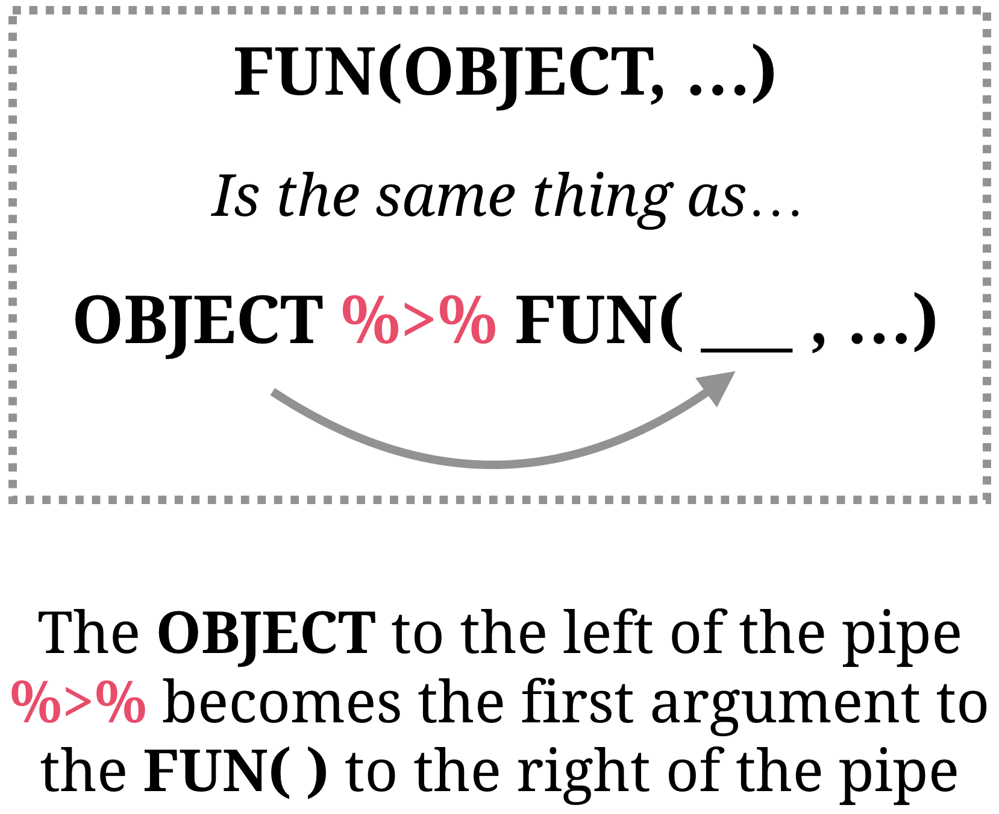
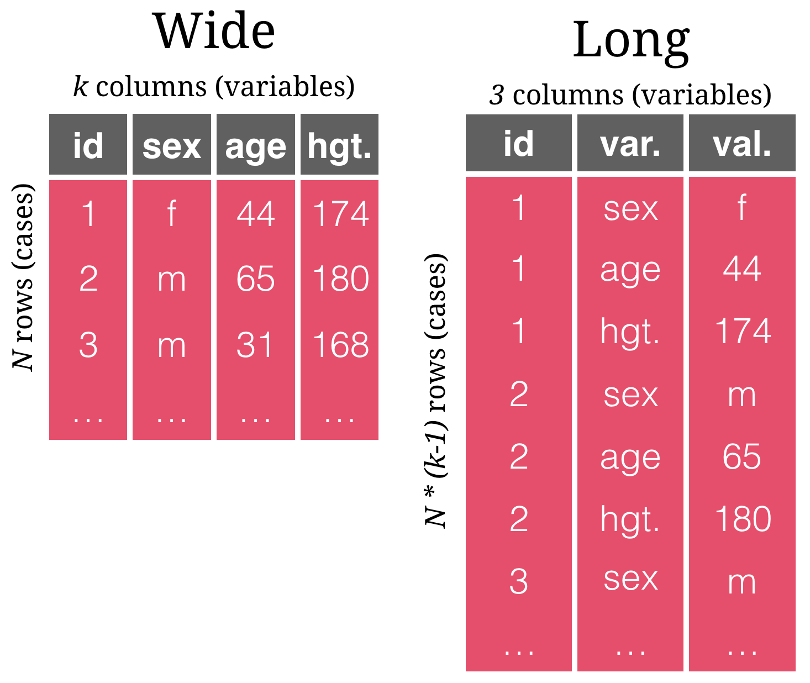

layout: true

<div class="my-footer">
  <span style="text-align:center">
    <span> 
      
    </span>
    <a href="https://therbootcamp.github.io/">
      <span style="padding-left:82px"> 
        <font color="#7E7E7E">
          www.therbootcamp.com
        </font>
      </span>
    </a>
    <a href="https://therbootcamp.github.io/">
      <font color="#7E7E7E">
       Introduction to R | February 2019
      </font>
    </a>
    </span>
  </div> 

---
  
```{r, eval = FALSE, echo = FALSE}
# Code to knit slides
xaringan::inf_mr('_sessions/D1S2_Wrangling/Wrangling.Rmd')
baselers <- read_csv("https://raw.githubusercontent.com/therbootcamp/baselers/master/inst/extdata/baselers.txt")


```

```{r setup, include=FALSE}
options(htmltools.dir.version = FALSE)
options(width=110)
options(digits = 4)
library(tidyverse)
baselers <- read_csv("https://raw.githubusercontent.com/therbootcamp/baselers/master/inst/extdata/baselers.txt")
```


# What is wrangling?

<p align = "center">
<br>
<font style="font-size:10px">from <a href="https://datasciencebe.com/tag/data-wrangling/">datasciencebe.com</a></font>
</p>


---

.pull-left45[

# This is wrangling!

<div style="padding-bottom:10px"></div>

#### <high>Transform</high>

Change variable names

Add new variables

#### <high>Organise</high></font>

Sort data by variables

Merging data from two separate dataframes

Move data between variables and rows

#### <high>Aggregate and summarise</high></font>

Group data and calculate and summary stats


]

.pull-right5[
<br>
<p align="center">

</p>

]

---


# `dplyr` + `tidyr`

.pull-left5[

To wrangle data in R, we will use the <high><mono>dplyr</mono></high> and <high><mono>tidyr</mono></high> packages, which are part of the <high><mono>tidyverse</mono></high>.

| Package | Function| Function|
|:-------------|:----|
|<b>dplyr</b> | Transformation | `rename()`, `mutate()`, `case_when()`, `*_join()`  |
|<b>dplyr</b> | Organisation | `arrange()`, `slice()`, `filter()`, `select()`  |
|<b>tidyr</b> | Organisation | `gather()`, `spread()` |
|<b>dplyr</b> | Aggregation | `group_by()`, `summarise()` |

]
 
.pull-right4[

<p align = "center">

</p>


]

---

# The Pipe!  <high>`%>%`</high>

.pull-left4[

`dplyr` makes extensive use of a new operator called the <high><i>Pipe</i> `%>%`</high><br>

Read the <high><i>Pipe</i> `%>%`</high> as "And Then..."

<br>

```{r, eval = FALSE, echo = TRUE}
# Start with data
data %>% # AND THEN...
  
DO_SOMETHING %>% # AND THEN...
  
DO_SOMETHING %>% # AND THEN...
  
DO_SOMETHING %>% # AND THEN...

```

]

.pull-right55[

<p align="center">
  <br>
<br><i>This is not a pipe. But <mono>%>%</mono> is!</i>
</p>

]


---

# The Pipe!  <high>`%>%`</high>

.pull-left4[

```{r}
#  Vector of `scores`
score <- c(8, 4, 6, 3, 7, 3)
score

# Mean: Base-R-way
mean(x = score)

# Mean: Tidyverse-style (with %>%)
score %>%  # AND THEN 
  mean()  
```


]

.pull-right55[

<p align="center">
  
</p>

]

---

# The Pipe! <high>`%>%`</high>

.pull-left4[

```{r}
#  Vector of `scores`
score <- c(8, 4, 6, 3, 7, 3)
score

# Mean: Base-R-way
mean(x = score, digits = 1)

# Mean: Tidyverse-style (with %>%)
score %>%     # AND THEN
  mean() %>%  # AND THEN
  round(digits = 1)
```

]

.pull-right55[

<p align="center">
  
</p>

]

---


.pull-left4[

# 2 dirty data sets

### Goals

<b>1</b> <i>Rename</i> - Give meaningful <high>variable names</high>.<br><br>
<b>2</b> <i>Recode</i> - Use appropriate <high>units</high> and <high>labels</high> for nominal variables.<br><br>
<b>3</b> <i>Join</i> - <high>Combine</high> datasets.<br><br>
<b>4</b> <i>Sort</i> - <high>Sort</high> tibble by age. <br><br>
<b>5</b> <i>Filter</i> - Select relevant <high>cases</high>. <br><br>
<b>6</b> <i>Select</i> - Select relevant <high>variables</high>.<br><br>
<b>7</b> <i>Spread</i> - Change to <high>wide format</high>.<br><br>


]

.pull-right45[

<br><br2>

```{r, echo = F}
patients <- tibble(ID = c(1, 2, 3, 4, 5),
                   X1 = c(37, 65, 57, 34, 45),
                   X2 = c(1, 2, 2, 1, 2))

```

```{r}
# patients tibble
patients
```


```{r, echo = F}
results <- tibble(id = c(4, 92, 1, 2, 99),
                  t_1 = c(100, 134, 123, 143, 102),
                  t_2 = c(105, 150, 135, 140,68))
```

```{r}
# results tibble
patients
```

]


---

# Transformation

.pull-left4[

Transformation functions are used to <high>alter the content</high> of a `tibble`.

<br2>

| Function| Description|
|:-------------|:----|
| `rename()` | <high>Change names</high> of variables |
| `mutate()`|   <high>Create variable</high> from existing variables|
| `case_when()`|  <high>Recode values</high> from a vector to another|
| `left_join()` | <high>Combine tibbbles</high> |

]

.pull-right5[

```{r, echo = F}
options(tibble.width = 60)   # Baselers data
```

```{r}
patients   # Baselers data
```


]


---

# `rename()` 

.pull-left4[

<high>Change variable names</high> with `rename()`.

```{r, eval = FALSE, echo = TRUE}
patients %>%
  rename(NEW = OLD,
         NEW = OLD)
```

```{r}
patients  # Original
```
]

.pull-right5[

Change `X1` to `age`, and `X2` to `arm`.

```{r}
# 0) Start with patients data
patients %>% 

# 1) Change variable names with rename()
  rename(age = X1,  # New = Old
         arm = X2)  # New = Old
```


]

---

# `mutate()` 

.pull-left4[

Create <high>new variables</high>, or <high>change existing ones</high>, with `mutate()`.

```{r, eval = FALSE}
tibble %>%
  mutate(
   NEW1 = DEFINITION1,
   NEW2 = DEFINITION2,
   NEW3 = DEFINITION3,
   ...
  )
```
]

.pull-right5[

Calculate two new variables `age_months` and `age_decades`.

```{r, warning = FALSE}
patients %>% 

  rename(age = X1, 
         arm = X2) %>%   # AND THEN...
  
# Create new variables with mutate()
  mutate(age_months = age * 12,
         age_decades = age / 10)
```

]

---

# `case_when()`

.pull-left4[

Use `case_when()` with `mutate()` to define <high>new variables based on logical conditions</high>.

```{r, eval = FALSE}
# Using mutate(case_when())
tibble %>%
  mutate(
    NEW = case_when(
      COND1 ~ VAL1,
      COND2 ~ VAL2
    ))

```


]

.pull-right55[

Create `arm_lab` that carries `'placebo'` for `arm == 1` and `'drug'` for `arm == 2`.

```{r}
patients %>% 

  rename(age = X1, 
         arm = X2) %>%
  
  # Create arm_lab from arm
  mutate(arm_lab = case_when(arm == 1 ~ "placebo",
                             arm == 2 ~ "drug"))
```

]


---

# Joining data
 
<p align="center">
  
</p> 


---

# `left_join()`

.pull-left35[

Use `left_join()` to <high>combine two data frames</high> based on one or more key variables.

```{r, eval = FALSE}
# Join tibble_1 to tibble_2
#   matched by KEY
tibble_1 %>%
  left_join(tibble_2, 
      by = c("KEY"))
```

Other `*_join()` functions: `right_join()`, `full_join()`, `inner_join()`, `anti_join()`, `semi_join()`.

]

.pull-right6[

```{r,error=TRUE}
# Join patients with results to create combined
combined <- patients %>% 
  rename(age = X1, arm = X2) %>%
  mutate(arm_lab = case_when(arm == 1 ~ "placebo",
                              arm == 2 ~ "drug")) %>%
  
# Join with results with left_join()
  left_join(results, by = "id")

```

```{r, eval = F}
# Show a few variables
combined %>%
  select(id, arm, age, t_1, t_2)
```

]

---

# `left_join()`

.pull-left35[

Use `left_join()` to <high>combine two data frames</high> based on one or more key variables

```{r, eval = FALSE}
# Join tibble_1 to tibble_2
#   matched by KEY
tibble_1 %>%
  left_join(tibble_2, 
      by = c("KEY"))
```


Other `*_join()` functions: `right_join()`, `full_join()`, `inner_join()`, `anti_join()`, `semi_join()`.


]

.pull-right6[

```{r,error=TRUE}
# Join patients with results to create combined
combined <- patients %>% 
  rename(age = X1, arm = X2, id = ID) %>%
  mutate(arm_lab = case_when(arm == 1 ~ "placebo",
                              arm == 2 ~ "drug")) %>%
  
# Join with results with left_join()
  left_join(results, by = "id")

# Show a few variables
combined %>%
  select(id, arm, age, t_1, t_2)
```

]

---

# Organisation

.pull-left4[

Organisation functions help you change the organisation of your data by <high>sorting rows</high> by variables, <high>filter rows</high> based on criteria, <high>select variables</high> (etc).

| Function| Description|
|:--------|:----|:-------------|
| `arrange()` |<high>Sort rows</high> by variables|
| `slice()`|   <high>Select rows</high> by location|
| `filter()` | <high>Select rows</high> by criteria|
| `select()`|   <high>Select variables</high>|

]

.pull-right55[

```{r}
# combined tibble
combined
```

```

]

---

# `arrange()`

.pull-left4[

Use `arrange()` to <high>sort rows</high> in increasing or decreasing (using `desc()`) order of one or more variables.

```{r, echo = TRUE, eval = FALSE}
tibble %>%
  arrange(A, B)
```

To sort in descending order, use `desc()`

```{r, echo = TRUE, eval = FALSE}
tibble %>%
  arrange(desc(A), B)
```

]

.pull-right55[

Sort by `arm`.

```{r}
combined %>%
  arrange(arm)   # Sort by arm
```


]

---

# `arrange()`

.pull-left4[

Use `arrange()` to <high>sort rows</high> in increasing or decreasing (using `desc()`) order of one or more variables.

```{r, echo = TRUE, eval = FALSE}
tibble %>%
  arrange(A, B)
```

To sort in descending order, use `desc()`

```{r, echo = TRUE, eval = FALSE}
tibble %>%
  arrange(desc(A), B)
```

]

.pull-right55[


Sort by `arm` and then `age`.

```{r}
combined %>%
  arrange(arm, age)  # Sort by arm then age
```

]


---

# `slice()`

.pull-left4[

Use `slice()` to <high>select rows</high> (or remove) by row number.

Use `c()`, `a:b`, or `seq()` to create row numbers

```{r}
# Integer vector
c(2, 6, 10)

# Integer vector of 0 to 5
0:5
```


]

.pull-right55[

Select rows `3` and `5`.

```{r}
# Rows 3 and 5 only
combined %>%
  slice(c(3, 5))
```


]

---

# `slice()`

.pull-left4[

Use `slice()` to <high>select rows</high> (or remove) by row number.

Use `c()`, `a:b`, or `seq()` to create row numbers

```{r}
# Integer vector
c(2, 6, 10)

# Integer vector of 0 to 5
0:5
```

]

.pull-right55[


Select rows `1` through `4`.

```{r}
# First 5 rows
combined %>%
  slice(1:4)
```

]

---

# `filter()`

.pull-left4[

Use `filter()` to <high>select rows</high> (or remove) based on logical statements.

<high>Chain</high> logical comparison operators with `&` (AND) and `|` (OR).

<high>`==`</high> - is equal to<br>
<high>`<`</high>, <high>`>`</high> - smaller/greater than<br>
<high>`≤`</high>, <high>`≥`</high> - smaller/greater than or equal<br>
<high>`&`</high>, <high>`&&`</high> - logical AND<br>
<high>`|`</high>, <high>`||`</high> - logical OR<br>

]

.pull-right55[

Select <i>only</i> patients over `30`.

```{r}
# Filter patients older than 30
combined %>%
  filter(age > 30)
```

]


---

# `filter()`

.pull-left4[

Use `filter()` to <high>select rows</high> (or remove) based on logical statements.

<high>Chain</high> logical comparison operators with `&` (AND) and `|` (OR).

<high>`==`</high> - is equal to<br>
<high>`<`</high>, <high>`>`</high> - smaller/greater than<br>
<high>`≤`</high>, <high>`≥`</high> - smaller/greater than or equal<br>
<high>`&`</high>, <high>`&&`</high> - logical AND<br>
<high>`|`</high>, <high>`||`</high> - logical OR<br>

]

.pull-right55[

Select <i>only</i> patients over `30` given arm is `'drug'`.

```{r}
# Filter patients older than 30 given drug
combined %>%
  filter(age > 30 & arm_lab == "drug")
```

]


---

# `select()`

.pull-left4[

Use `select()` to <high>select variables</high> (or remove).

<high>Remove variables</high> with `-` (minus).

```{r, eval = FALSE}
# Select variables A, B
 %>% 
  select(A, B)
  
# Select everything BUT A
tibble %>% 
  select(-A)  
```


]

.pull-right55[

Select variables `id` and `arm`.

```{r}
combined %>%
  select(id, arm) # Select id and arm variables
```

]


---

# `select()`

.pull-left4[

Use `select()` to <high>select variables</high> (and remove all others)

```{r, eval = FALSE}
# Select variables A, B
tibble %>% 
  select(A, B)
```

<high>Remove variables</high> with `-`.

```{r, eval = FALSE}
# Select everything BUT A
tibble %>% 
  select(-A)
```


]

.pull-right55[

Select everything <i>except</i> id

```{r}

combined %>%
  select(-id) # Everything BUT id
```

]


---

# Long and wide formats

.pull-left4[

Some functions require data to be in a certain shape, that is to be either in a wide or a long format.

Use <high>`gather()`</high> and <high>`spread()`</high> from the `tidyr`package to change a tibble between <high>wide</high> and <high>long</high> formats.

<br>

| Function | Result |
|:----------|:-------|
|`gather()`|<high>wide &#8594; long</high> format|
|`spread()`|<high>long &#8594; wide</high> format|

]

.pull-right55[

<p align="center">

</p>

]

---

# `gather()`

.pull-left45[

```{r}
# Show original data (wide)
combined
```

]

.pull-right45[

```{r}
# "Gather" wide data to long
combined %>% 
  gather(time,  # New group variable
         value, # New target variable
         -id)   # Omit ID
```

]

---

# `gather()`

.pull-left45[


```{r}
# Show original data (wide)
combined
```

]

.pull-right45[


```{r}
# "Gather" wide data to long
combined %>% 
  gather(time,  # New group variable
         value, # New target variable
         -id, -age, -arm, -arm_lab) # Omit variables
```

]

---

# `spread()`

.pull-left45[

```{r}
# Show long data
combined %>% 
  gather(time,  # New group variable
         value, # New target variable
         -id, -age, -arm, -arm_lab) # Omit variables
```


]

.pull-right45[

```{r}
# "Gather" wide data to long
long_combined = combined %>% 
  gather(time,  # New group variable
         value, # New target variable
         -id, -age, -arm, -arm_lab) # Omit variables
         
# "Spread" long data to wide
long_combined %>%
  spread(time,   # Old group variable
         value)  # Old target variable
```

]


---

class: middle, center

<h1><a href="https://therbootcamp.github.io/appliedML_2019Jan/_sessions/Models/Models_practical.html">Practical</a></h1>

